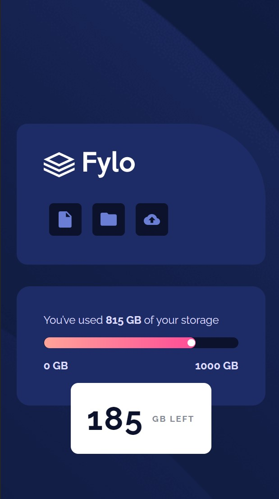

## Hello! 👋
Thanks for checking out my front-end coding solution. This is a solution to the [Fylo data storage component challenge on Frontend Mentor](https://www.frontendmentor.io/challenges/fylo-data-storage-component-1dZPRbV5n).

### Screenshot

### Links

- Solution URL: [Here](https://www.frontendmentor.io/solutions/fylodatastoragecomponentfrontendmentor-eqKu9hQpm3)
- Live Site URL: [Here](https://ozlemxates.github.io/Fylo-Data-Storage-Component-Frontend-Mentor/)

### Built with

- Semantic HTML5 markup
- CSS custom properties
- Flexbox

### What I learned

In this project, my goal was to take my previously learned and practiced CSS and HTML skills to the next level. I aimed to create code that is cleaner and more understandable, striving for a more consistent and maintainable coding style when building the project. So, I tried to  make as effective as possible use of CSS selectors, classes, and IDs to target specific elements and apply styles consistently. And for HTML, I focused on creating well-structured and semantically meaningful markup. 

###### Key Objectives
- Enhancing CSS and HTML skills
- Writing clean and understandable code
- Striving for optimal solutions and approaches
- Improving code readability and maintainability

### Thanks for checking out! 🚀 

